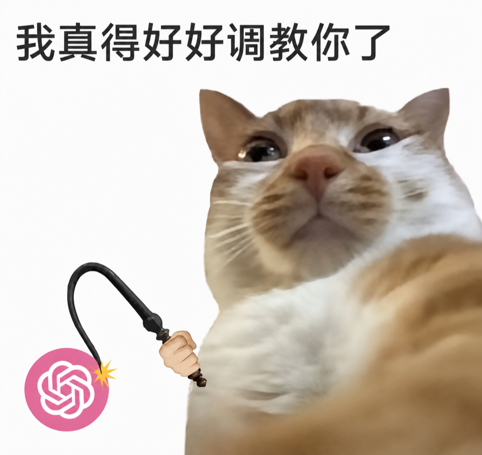

# Codex 快重置了，你还在省额度？我做了个“猛蹬雷达”



> 找到重置机会，站起来猛蹬。

我用 Codex 时遇到过一个很亏的场景：一直省着额度，想做的长任务没跑，第二天却突然全局重置了。

如果能提前几个小时知道，旧额度就不用白白浪费。于是我做了 **Codex Reset Watcher**，专门盯 X 上的重置信号。

## 它真的有用吗？

我先回看了截至 2026 年 8 月 31 日的最近 10 次重置：

| 指标 | 历史结果 |
| --- | ---: |
| 最终找到一手确认 | **10 / 10** |
| 重置前出现过一手线索 | **9 / 10（90%）** |
| 重置前已有清晰、可理解的提醒 | **6 / 10（60%）** |
| 清晰提醒的中位提前量 | **约 16 小时** |
| 10 次事件的平均间隔 | **约 3.7 天** |
| 只看 hard reset 的平均间隔 | **约 4.1 天** |

这 10 次从 7 月 29 日到 8 月 31 日，横跨约 32.9 天，包含 9 次 hard reset 和 1 次 banked reset。全部事件的间隔中位数约为 2.2 天，只看 hard reset 则约为 2.6 天；说明重置有时很密集，偶尔也会隔上一周以上。

这里的 90% 是“已确认事件中，事前找到一手线索的覆盖率”，不是预测准确率。要计算真正的预测准确率，还需要完整记录那些最终没有发生重置的误报；目前的数据不足以诚实地给出这个数字。

[查看最近 10 次的完整时间轴和原帖证据](https://github.com/farmcan/codex-reset-watcher/blob/main/docs/historical-audit.md)

## 它怎么做

```text
每小时查询官方 X API
→ 区分官方、转述、传闻和个人到账
→ 保存证据并交叉验证
→ 网页展示，重要消息可发邮件
```

官方消息会压过旧传闻；单个用户到账不会被当成全局重置；两个独立社区来源同时出现，才可能提高关注等级。整套判断由固定代码完成，不让大模型自由猜测。

它不读取你的 Codex 账号，也不预测下一次重置的精确时间。个人额度仍以 [Codex Usage](https://chatgpt.com/codex/settings/usage) 为准。

## 试试看

- [打开实时雷达](https://codex-reset-watcher.weican16hit.workers.dev/)
- [查看开源代码](https://github.com/farmcan/codex-reset-watcher)

它不能预知未来，只负责在公开线索出现时，尽量别让你后知后觉。

该省的时候省。机会来了——站起来猛蹬。
